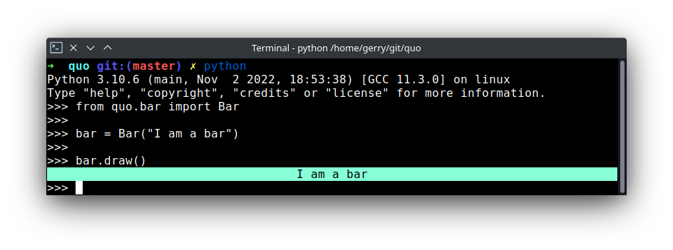
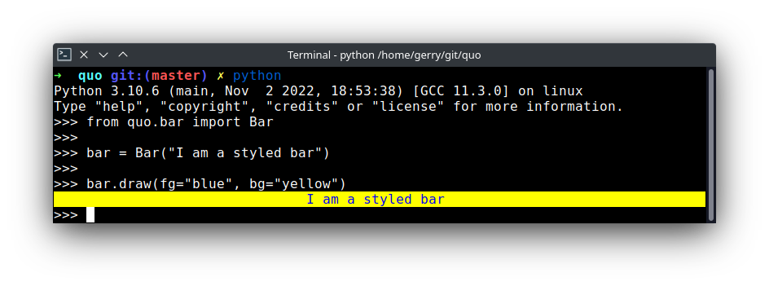
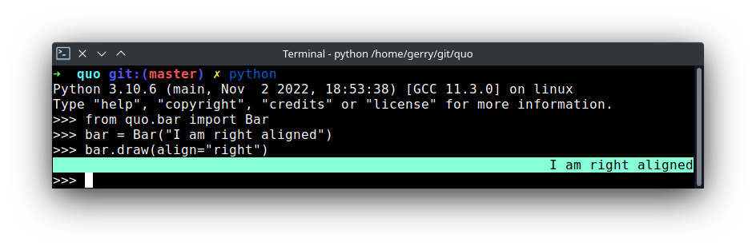

.. _bars:

Bars
==========

``Bar``
---------
The :class:`~quo.bar.Bar` can be used to draw a horizontal bar with an optional title, which is a good way of dividing your terminal output in to sections.
*Added on v2023.3*

**Parameters**
      - ``message`` Optional[*(str)*] – Message print on the terminal.
      - ``align`` Optional[*(str)*] - Postion of the message to be printed. Default is ``center`` other options are ``left`` and ``right``.
      - ``fg`` Optional[*(str)*] - Foreground color  to be applied.
      - ``bg`` Optional[*(str)*] - Background color to be applied.

.. code:: python

   from quo.bar import Bar
   
   bar = Bar("I am a bar")

   bar.draw()
   

.. code:: python

   from quo.bar import Bar
   
   bar = Bar("I am a styled bar")

   bar.draw(fg="blue", bg="yellow")

.. code:: python

   from quo.bar import Bar
   
   bar = Bar("I am right aligned")

   bar.draw(align="right")
   

 
   

   
  

