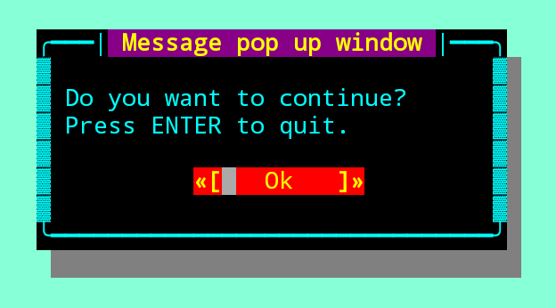
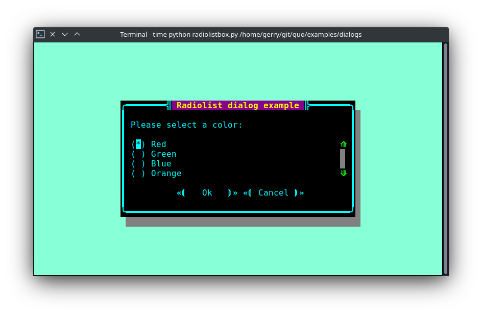
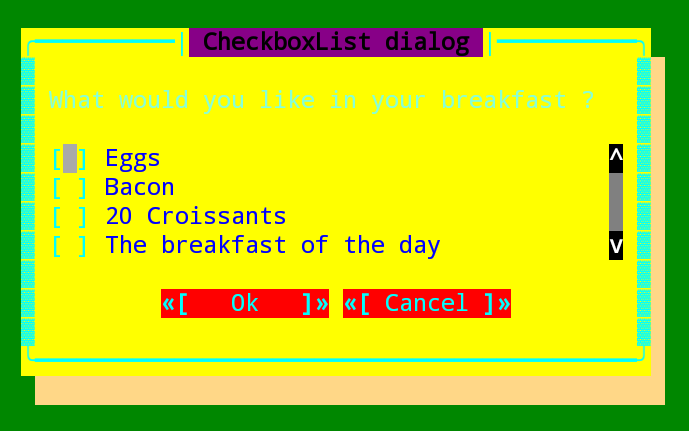

.. _dialogs:

Dialogs
=======
Quo ships with a high level API for displaying `dialog boxes <https://en.m.wikipedia.org/wiki/Dialog_box>`_ to the user for informational purposes, or get input from the user.

*Deprecated :meth:`.run` on v2022.3.2*

``Message Box``
---------------

Use the :func:`~quo.dialog.MessageBox` function to display a
simple message box. For instance:

.. code:: python

    from quo.dialog import MessageBox

    MessageBox(
        title='Example dialog window',
        text='Do you want to continue?\nPress ENTER to quit.')

``Input Box``
--------------

The :func:`~quo.dialog.InputBox` function can display an
input box. It will return the user input as a string.

.. code:: python

    from quo.dialog import InputBox
    InputBox(
        title='Input dialog example',
        text='Please type your name:')
.. image:: ./images/inputbox.png

The ``hide=True`` option can be passed to the
:func:`~quo.dialog.InputBox` function to turn this into a password input box.

``Confirm Box``
--------------------

The :func:`~quo.dialog.ConfirmBox` function displays a yes/no confirmation dialog. It will return a boolean according to the selection.

.. code:: python

    from quo.dialog import ConfirmBox

    ConfirmBox(
        title='Yes/No dialog example',
        text='Do you want to confirm?')
.. image:: ./images/confirm.png

``Choice Box``
---------------

The :func:`~quo.dialog.ChoiceBox` function displays a dialog
with choices offered as buttons. Buttons are indicated as a list of tuples, each providing the label (first) and return value if clicked (second).

.. code:: python

    from quo.dialog import ChoiceBox

    ChoiceBox(
        title='Button dialog example',
        text='Do you want to confirm?',
        buttons=[
            ('Yes', True),
            ('No', False),
            ('Maybe...', None)
        ],)

.. image:: ./images/button.png

``Radiolist Box``
-----------------

The :func:`~quo.dialog.RadiolistBox` function displays a dialog
with choices offered as a radio list. The values are provided as a list of tuples,
each providing the return value (first element) and the displayed value (second element).

.. code:: python

    from quo.dialog import RadiolistBox

    RadiolistBox( 
        title="RadioList dialog", 
        text="Which breakfast would you like ?", 
        values=[ 
            ("breakfast1", "Eggs and beacon"), 
            ("breakfast2", "French breakfast"), 
            ("breakfast3", "Equestrian breakfast") 
        ])

``Check Box``
-------------

The :func:`~quo.dialog.CheckBox` has the same usage and purpose than the Radiolist dialog, but allows several values to be selected and therefore returned.

.. code:: python

    from quo.dialog import CheckBox

    CheckBox( 
        title="CheckboxList dialog", 
        text="What would you like in your breakfast ?",
        values=[ 
            ("eggs", "Eggs"),
            ("bacon", "Bacon"),
            ("croissants", "20 Croissants"),
            ("daily", "The breakfast of the day")
        ] 
    )

``Styling of dialogs``
-----------------------

A custom :class:`~quo.style.Style` instance can be passed to alldialogs to override the default style. Also, text can be styled by passing an :class:`~quo.text.Text` object.

.. code:: python

  from quo.dialog import MessageBox
  from quo.style import Style
  from quo.text import Text

  style = Style.add({
      'dialog': 'bg:aquamarine',
      'dialog.body': 'bg:black fg:green',
      'dialog shadow': 'bg:yellow' })

  MessageBox(
      title=Text(' '
      ' window'),
      text='Do you want to continue?\nPress ENTER to quit.',
      style=style)

.. image:: ./images/dialog/styled1.png

``Styling reference sheet``
----------------------------

In reality, the dialog commands presented above build a full-screen frame by using a list of components. The two tables below allow you to get the classnames available for each dialog therefore you will be able to provide a custom style for every element that is displayed, using the method provided above.

.. note:: All the dialogs use the ``Dialog`` component, therefore it isn't specified explicitly below.

+--------------------------------+-------------------------+
| Shortcut                       | Components used         |
+================================+=========================+
| ``quo.dialog.ConfirmationBox`` | - ``Label``             |
|                                | - ``Button`` (x2)       |
+--------------------------------+-------------------------+
| ``quo.dialog.ChoiceBox``       | - ``Label``             |
|                                | - ``Button``            |
+--------------------------------+-------------------------+
| ``quo.dialog.PromptBox``       | - ``TextArea``          |
|                                | - ``Button`` (x2)       |
+--------------------------------+-------------------------+
| ``quo.dialog.MessageBox``      | - ``Label``             |
|                                | - ``Button``            |
+--------------------------------+-------------------------+
| ``quo.dialog.RadiolistBox``    | - ``Label``             |
|                                | - ``RadioList``         |
|                                | - ``Button`` (x2)       |
+--------------------------------+-------------------------+
| ``quo.dialog.CheckBox``        | - ``Label``             |
|                                | - ``CheckboxList``      |
|                                | - ``Button`` (x2)       |
+--------------------------------+-------------------------+
| ``quo.dialog.ProgressBox``     | - ``Label``             |
|                                | - ``TextArea`` (locked) |
|                                | - ``ProgressBar``       |
+--------------------------------+-------------------------+

+----------------+------------------------+
| Components     | Available classnames   |
+================+========================+
| Dialog         | - ``dialog``           |
|                | - ``dialog.body``      |
+----------------+------------------------+
| TextArea       | - ``text-area``        |
|                | - ``text-area.prompt`` |
+----------------+------------------------+
| Label          | - ``label``            |
+----------------+------------------------+
| Button         | - ``button``           |
|                | - ``button.focused``   |
|                | - ``button.arrow``     |
|                | - ``button.text``      |
+----------------+------------------------+
| Frame          | - ``frame``            |
|                | - ``frame.border``     |
|                | - ``frame.label``      |
+----------------+------------------------+
| Shadow         | - ``shadow``           |
+----------------+------------------------+
| RadioList      | - ``radio-list``       |
|                | - ``radio``            |
|                | - ``radio-checked``    |
|                | - ``radio-selected``   |
+----------------+------------------------+
| CheckboxList   | - ``checkbox-list``    |
|                | - ``checkbox``         |
|                | - ``checkbox-checked`` |
|                | - ``checkbox-selected``|
+----------------+------------------------+
| VerticalLine   | - ``line``             |
|                | - ``vertical-line``    |
+----------------+------------------------+
| HorizontalLine | - ``line``             |
|                | - ``horizontal-line``  |
+----------------+------------------------+
| ProgressBar    | - ``progress-bar``     |
|                | - ``progress-bar.used``|
+----------------+------------------------+

Example
_______

Let's customize the example of the ``Check Box``.

It uses 2 ``Button``, a ``CheckboxList`` and a ``Label``, packed inside a ``Dialog``.
Therefore we can customize each of these elements separately, using for instance:

.. code:: python

 from quo.dialog import CheckBox
 from quo.style import Style
 
 style = Style.add({
            'dialog': 'bg:green',
            'button': 'bg:red',
            'checkbox': 'fg:blue',
            'dialog.body': 'bg:yellow',
            'dialog shadow': 'bg:khaki',
            'frame.label': 'fg:black',
            'dialog.body label': 'fg:aquamarine'})

 CheckBox(
        title="CheckboxList dialog",
        text="What would you like in your breakfast ?",
        values=[
            ("eggs", "Eggs"),
            ("bacon", "Bacon"),
            ("croissants", "20 Croissants"),
            ("daily", "The breakfast of the day")
        ],
        style = style)

» Check out more examples `here <https://github.com/scalabli/quo
/tree/master/examples/dialogs/>`
