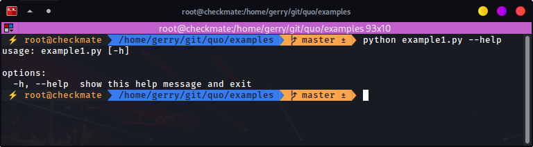
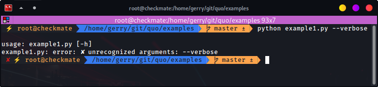
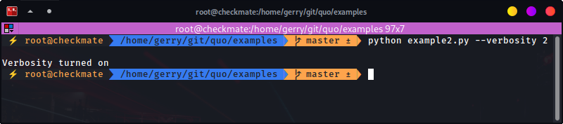
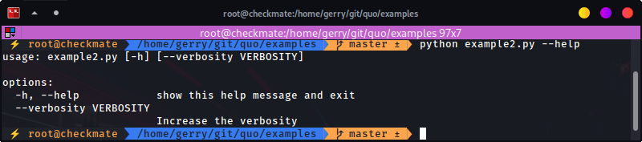
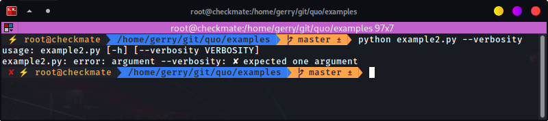

Parse
=============

.. currentmodule:: quo

This is intended to be a gentle introduction to :class:`Parser`, a command-line parsing class based on argparse.

Optional arguments can be added to commands using the :class:`quo.parse.Parser`.

Optional arguments in Quo are profoundly configurable and ought not to be mistaken for :ref:`positional arguments <arguments>`.

**Parameters**
    - ``filename`` *(str)* - The name of the file to open (or ``'-'`` for stdin/stdout).
    - ``prog`` - The name of the program (default:``os.path.basename(sys.argv[0])``)
    - ``color`` *(bool)* - Print a colorful help output
    - ``usage`` - A usage message (default: auto-generated from arguments)
    - ``description`` - A description of what the program does
    - ``epilog`` - Text following the argument descriptions
    - ``argument_default`` - The default value for all arguments
    - ``add_help`` *(bool)* - Add a -h/-help option
    - ``allow_abbrev`` *(bool)*- Allow long options to be abbreviated unambiguously
    - ``exit_on_error`` *(bool)* - Determines whether or not ArgumentParser exits with error info when an error occurs

``How to name Optional Arguments``
-------------------------------------

For the purpose of uniformity, a name is chosen in the following order

1.  In the event that the name is not prefixed with `--` or `-`, it will be considered a positional argument.

2.  If there is more than one name prefixed with `--` or `-`,  the first one given is used as the name.

The basics
^^^^^^^^^^^^^
Let us start with a very simple example which does (almost) nothing:

.. code:: python

   from quo.parse import Parser
   arg = Parser()
   arg.parse()
   
   
Following is a result of running the code:

.. code:: shell

   python example1.py --help
   
   

.. code:: shell

   python example1.py --verbose
   

Running the script without any options results in nothing displayed to stdout. Not so useful.
The second one starts to display the usefulness of :class:`Parser`. We have done almost nothing, but already we get a nice help message.

The `--help` option, which can also be shortened to `-h`, is the only option we get for free (i.e. no need to specify it). Specifying anything else results in an error. But even then, we do get a useful usage message.

.. code:: python

   from quo.parse import Parser
   
   optional = Parser()
   optional.argument("--verbosity", help="Increase the verbosity")
   arg = optional.parse()
   if arg.verbosity:
          print("Verbosity turned on")
          
          
.. code:: console

   python example2.py --verbosity 1
   

.. code:: console

   python example2.py --help
   

.. code:: console

   python example2.py --verbosity
   

          
          
 We’ve added the :meth:`argument` method, which is what we use to specify which command-line options the program is willing to accept. In this case, I’ve named it `--verbosity` so that it’s in line with its function.
        
The program above is written so as to display something when `--verbosity` is specified and display nothing when not specified.
To show that the option is actually optional, there is no error when running the program without it. 

.. note::
   By default, if an optional argument isn’t used, the relevant variable, in this case `argsverbosity`, is given None as its value.
   

When using the optional argument in this case `--verbosity` option, one must also specify some value, any value.

The above example accepts arbitrary integer values for --verbosity, but for our simple program, only two values are actually useful, True or False. Let’s modify the code accordingly:

.. code:: python

   from quo.parse import Parser
   
   optional = Parser()
   optional.argument("--verbose", help="Increase the verbosity", action="store_true")
   arg = optional.parse()
   if arg.verbose:
          print("Verbosity turned on")
          

    
And the output:

.. code:: console

   python example2.py --verbose

.. code:: console

   python example2.py --verbose 1
   
   
   
.. code:: console

   python example2.py --help

Here is what is happening:

The option is now more of a flag than something that requires a value. We even changed the name of the option to match that idea. Note that we now specify a new keyword, action, and give it the value "store_true". This means that, if the option is specified, assign the value True to arg.verbose. Not specifying it implies False.

It complains when you specify a value, in true spirit of what flags actually are.

Notice the different help text.

Short options
^^^^^^^^^^^^^^^^^^
If you are familiar with command line usage, you will notice that I haven’t yet touched on the topic of short versions of the options. It’s quite simple:

.. code:: python

   from quo.parse import Parser
   
   optional = Parser()
   optional.argument("-v", "--verbose", help="Increase the verbosity", action="store_true")
   arg = optional.parse()
   if arg.verbose:
          print("Verbosity turned on")

And here goes:

.. code:: console

   python example3.py -v

/image/

.. code:: console

   python example3.py --help

/image/
  
Note that the new ability is also reflected in the help text.

import argparse
The help message is a bit different.

Positional Arguments
========================
Introducing Positional arguments
An example:

.. code:: python

   from quo.parse import Parser
   
   positional = Parser()
   
   positional.argument("echo")
   arg = positional.parse()
   print(arg.echo)

Note however that, although the help display looks nice and all, it currently is not as helpful as it can be. For example we see that we got echo as a positional argument, but we don’t know what it does, other than by guessing or by reading the source code. So, let’s make it a bit more useful:

.. code:: python

   from quo.parse import Parser
   
   positional = Parser()
   
   positional.argument("echo", help="echo the string you use here")
   arg = positional.parse()
   print(arg.echo)

  -h, --help  show this help message and exit
Now, how about doing something even more useful:

.. code:: python

   from quo.parse import Parser
   
   positional = Parser()
   
   positional.argument("square", help="display a square of a given number")
   arg = positional.parse()
   print(arg.square**2)
   
   
   
Following is a result of running the code:

.. code:: console

   python prog.py 4
   

That didn’t go so well. That’s because :class:`Parser` treats the options we give it as strings, unless we tell it otherwise. So, let’s tell it to treat that input as an integer:

.. code:: python

   from quo.parse import Parser
   
   positional = Parser()
   
   positional.argument("square", help="display a square of a given number", type=int)
   arg = positional.parse()
   print(arg.square**2)

Following is a result of running the code:

.. code:: console

   python prog.py 4

16

how about this...

.. code:: console
   
   python prog.py four
   
   

   
   
That went well. The program now even helpfully quit on illegal input before proceeding.

Combining Positional and Optional arguments
==================================================
Our program keeps growing in complexity:

.. code:: console

   from quo.parse import Parser
   
   parser = Parser()
   
   parser.argument("square", type=int, help="display a square of a given number")
   parser.argument("-v", "--verbose", action="store_true", help="increase output verbosity")
   arg = parser.parse()
 
   answer = arg.square**2
   
   if args.verbose:
        print(f"the square of {arg.square} equals {answer}")
      
   else:
     print(answer)

And now the output:

.. code:: console
   
   python prog.py
 
 

.. code:: console
   
   python3 prog.py 4 --verbose
   
     

   
Note that the order does not matter. The above program can be written like so:

.. code:: console
   
   python3 prog.py --verbose 4
   

How about we give this program of ours back the ability to have multiple verbosity values, and actually get to use them:

.. code:: python

   from quo.parse import Parser
   
   parser = Parser()
   
   parser.argument("square", type=int, help="display a square of a given number")
   parser.argument("-v", "--verbosity", type=int, help="increase output verbosity")
   arg = parser.parse()
 
   answer = arg.square**2
   
   if arg.verbosity == 2:
         print(f"the square of {arg.square} equals {answer}")
   elif arg.verbosity == 1:
       print(f"{arg.square}^2 == {answer}")
   else:
       print(answer)
       
And the output:

.. code:: console
   
   python prog.py  4

$ python3 prog.py 4
16

.. code:: console
   
   python prog.py 4 -v
$ python3 prog.py 4 -v
usage: prog.py [-h] [-v VERBOSITY] square
prog.py: error: argument -v/--verbosity: expected one argument

.. code:: console
   
   python prog.py 4  -v 1

.. code:: console
   
   python prog.py 4 -v 2
   

.. code:: console
   
   python prog.py 4 -v 3

These all look good except the last one, which exposes a bug in our program. Let’s fix it by restricting the values the ``--verbosity`` option can accept:

..code:: python

   from quo.parse import Parser
   
   parser = Parser()
   
   parser.argument("square", type=int, help="display a square of a given number")
   parser.argument("-v", "--verbosity", type=int, choices=[0, 1, 2], help="increase output verbosity")
   arg = parser.parse()
   
   answer = arg.square**2
   
   if arg.verbosity == 2:
       print(f"the square of {arg.square} equals {answer}")
       
   elif arg.verbosity == 1:
       print(f"{arg.square}^2 == {answer}")
       
   else:
    print(answer)

And the output:

.. code:: console
   
   python prog.py 4 -v 3
   
 
 
Note that the change also reflects both in the error message as well as the help string.  
.. code:: console
   
   python prog.py 4 -h

Now, let’s use a different approach of playing with verbosity, which is pretty common. It also matches the way the CPython executable handles its own verbosity argument (check the output of python --help):

..code:: python

   from quo.parse import Parser
   
   parser = Parser()
   
   parser.argument("square", type=int, help="display a square of a given number")
   parser.argument("-v", "--verbosity", action="count", help="increase output verbosity")
   arg = parser.parse()
   
   answer = arg.square**2
   if arg.verbosity == 2:
       print(f"the square of {arg.square} equals {answer}")
       
   elif arg.verbosity == 1:
       print(f"{arg.square}^2 == {answer}")
       
   else:
       print(answer)
       
We have introduced another action, ``count``, to count the number of occurrences of specific options.

.. code:: console
   
   python prog.py 4
   
   
.. code:: console
   
   python prog.py 4 -v
   
   
.. code:: console
   
   python prog.py 4 -vv

.. code:: console

   python prog.py 4 -v 1

.. code:: console
   python prog.py 4 -h

.. code:: console
   python prog.py 4 -vvv
 
 
 
Yes, it’s now more of a flag (similar to action="store_true") in the previous version of our script. That should explain the complaint.

It also behaves similar to “store_true” action.

Now here’s a demonstration of what the “count” action gives. You’ve probably seen this sort of usage before.

And if you don’t specify the -v flag, that flag is considered to have None value.

As should be expected, specifying the long form of the flag, we should get the same output.

Sadly, our help output isn’t very informative on the new ability our script has acquired, but that can always be fixed by improving the documentation for our script (e.g. via the help keyword argument).

That last output exposes a bug in our program.

Let’s fix:

import argparse
parser = argparse.ArgumentParser()
parser.add_argument("square", type=int,
                    help="display a square of a given number")
parser.add_argument("-v", "--verbosity", action="count",
                    help="increase output verbosity")
args = parser.parse_args()
answer = args.square**2

# bugfix: replace == with >=
if args.verbosity >= 2:
    print(f"the square of {args.square} equals {answer}")
elif args.verbosity >= 1:
    print(f"{args.square}^2 == {answer}")
else:
    print(answer)
And this is what it gives:

$ python3 prog.py 4 -vvv
the square of 4 equals 16
$ python3 prog.py 4 -vvvv
the square of 4 equals 16
$ python3 prog.py 4
Traceback (most recent call last):
  File "prog.py", line 11, in <module>
    if args.verbosity >= 2:
TypeError: '>=' not supported between instances of 'NoneType' and 'int'
First output went well, and fixes the bug we had before. That is, we want any value >= 2 to be as verbose as possible.

Third output not so good.

Let’s fix that bug:

import argparse
parser = argparse.ArgumentParser()
parser.add_argument("square", type=int,
                    help="display a square of a given number")
parser.add_argument("-v", "--verbosity", action="count", default=0,
                    help="increase output verbosity")
args = parser.parse_args()
answer = args.square**2
if args.verbosity >= 2:
    print(f"the square of {args.square} equals {answer}")
elif args.verbosity >= 1:
    print(f"{args.square}^2 == {answer}")
else:
    print(answer)
We’ve just introduced yet another keyword, default. We’ve set it to 0 in order to make it comparable to the other int values. Remember that by default, if an optional argument isn’t specified, it gets the None value, and that cannot be compared to an int value (hence the TypeError exception).

And:

$ python3 prog.py 4
16
You can go quite far just with what we’ve learned so far, and we have only scratched the surface. The argparse module is very powerful, and we’ll explore a bit more of it before we end this tutorial.

Getting a little more advanced
What if we wanted to expand our tiny program to perform other powers, not just squares:

import argparse
parser = argparse.ArgumentParser()
parser.add_argument("x", type=int, help="the base")
parser.add_argument("y", type=int, help="the exponent")
parser.add_argument("-v", "--verbosity", action="count", default=0)
args = parser.parse_args()
answer = args.x**args.y
if args.verbosity >= 2:
    print(f"{args.x} to the power {args.y} equals {answer}")
elif args.verbosity >= 1:
    print(f"{args.x}^{args.y} == {answer}")
else:
    print(answer)
Output:

$ python3 prog.py
usage: prog.py [-h] [-v] x y
prog.py: error: the following arguments are required: x, y
$ python3 prog.py -h
usage: prog.py [-h] [-v] x y

positional arguments:
  x                the base
  y                the exponent

options:
  -h, --help       show this help message and exit
  -v, --verbosity
$ python3 prog.py 4 2 -v
4^2 == 16
Notice that so far we’ve been using verbosity level to change the text that gets displayed. The following example instead uses verbosity level to display more text instead:

import argparse
parser = argparse.ArgumentParser()
parser.add_argument("x", type=int, help="the base")
parser.add_argument("y", type=int, help="the exponent")
parser.add_argument("-v", "--verbosity", action="count", default=0)
args = parser.parse_args()
answer = args.x**args.y
if args.verbosity >= 2:
    print(f"Running '{__file__}'")
if args.verbosity >= 1:
    print(f"{args.x}^{args.y} == ", end="")
print(answer)
Output:

$ python3 prog.py 4 2
16
$ python3 prog.py 4 2 -v
4^2 == 16
$ python3 prog.py 4 2 -vv
Running 'prog.py'
4^2 == 16
Conflicting options
So far, we have been working with two methods of an argparse.ArgumentParser instance. Let’s introduce a third one, add_mutually_exclusive_group(). It allows for us to specify options that conflict with each other. Let’s also change the rest of the program so that the new functionality makes more sense: we’ll introduce the --quiet option, which will be the opposite of the --verbose one:

import argparse

parser = argparse.ArgumentParser()
group = parser.add_mutually_exclusive_group()
group.add_argument("-v", "--verbose", action="store_true")
group.add_argument("-q", "--quiet", action="store_true")
parser.add_argument("x", type=int, help="the base")
parser.add_argument("y", type=int, help="the exponent")
args = parser.parse_args()
answer = args.x**args.y

if args.quiet:
    print(answer)
elif args.verbose:
    print(f"{args.x} to the power {args.y} equals {answer}")
else:
    print(f"{args.x}^{args.y} == {answer}")
Our program is now simpler, and we’ve lost some functionality for the sake of demonstration. Anyways, here’s the output:

$ python3 prog.py 4 2
4^2 == 16
$ python3 prog.py 4 2 -q
16
$ python3 prog.py 4 2 -v
4 to the power 2 equals 16
$ python3 prog.py 4 2 -vq
usage: prog.py [-h] [-v | -q] x y
prog.py: error: argument -q/--quiet: not allowed with argument -v/--verbose
$ python3 prog.py 4 2 -v --quiet
usage: prog.py [-h] [-v | -q] x y
prog.py: error: argument -q/--quiet: not allowed with argument -v/--verbose
That should be easy to follow. I’ve added that last output so you can see the sort of flexibility you get, i.e. mixing long form options with short form ones.

Before we conclude, you probably want to tell your users the main purpose of your program, just in case they don’t know:

..code:: python

   from quo.parse import Parser
   
   parser = Parser(description="calculate X to the power of Y")
   
   group = parser.add_mutually_exclusive_group()
   group.argument("-v", "--verbose", action="store_true")
   group.argument("-q", "--quiet", action="store_true")
   parser.argument("x", type=int, help="the base")
   parser.add_argument("y", type=int, help="the exponent")
   
   arg = parser.parse()
   answer = arg.x**arg.y

   if arg.quiet:
       print(answer)
   elif arg.verbose:
       print("{} to the power {} equals {}".format(arg.x, arg.y, answer))
   else:
       print("{}^{} == {}".format(arg.x, arg.y, answer))
       
       
Note that slight difference in the usage text. Note the [-v | -q], which tells us that we can either use -v or -q, but not both at the same time:

.. code:: console
   python prog.py --help

######################################################################################

