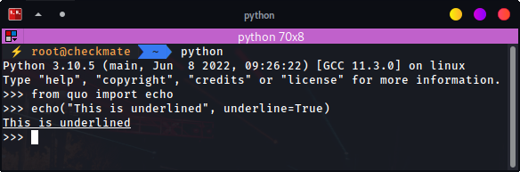
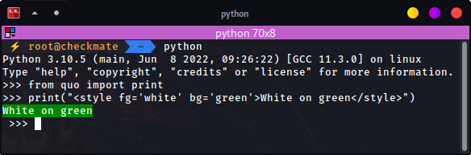

.. _printing_text:

Printing (and using) formatted text
===================================

``Formatted text``
-------------------

There are several ways to display colors:

- By creating a :func:`quo.echo` function.
- By creating a :func:`quo.print` function.
- By creating a list of ``(style, text)`` tuples mapped to :func:`quo.print`.

An instance of any of these three kinds of objects is called "formated text".

``echo``
--------
:func:`quo.echo` prints a message plus a newline to the given file or stdout. On first sight, this looks like the print function, but it has improved support for handling Unicode, binary data and formatted text. It will emit  newline by default, which cab be suppressed by passing :param: ``nl=False``

» List of supported `ANSI colors  <https://quo.readthedocs.io/en/latest/appendix/echo-ansi-colors.html>`_

**Parameters**
      * ``text`` – the string to style with ansi or rgb color codes.
      * ``fg``  – if provided this will become the foreground color.
      * ``bg``  – if provided this will become the background color.
      * ``bold``  – if provided this will enable or disable bold mode.
      * ``dim``  – if provided this will enable or disable dim mode.
      * ``nl`` - if provided this will print a new line.
      * ``ul or underline`` – if provided this will enable or disable underline.
      * ``italic`` - if provided this will print data in italic.
      * ``blink`` – if provided this will enable or disable blinking.
      * ``strike`` -if provided this will print a strikethrough text.
      * ``hidden`` - if privided this will prevent the input from getting printed.
      * ``reverse`` – if provided this will enable or disable inverse rendering (foreground becomes background and the other way round).
      * ``reset``  – by default a reset-all code is added at the end of the string which means that styles do not carry over. This can be disabled to compose styles.

.. code:: python

 from quo import echo

 echo("Hello, world!", nl=False)
 

.. code:: python

   from quo import echo

   echo("This is bold", bold=True)
   echo("This is italic", italic=True)
   

   # Colors from the ANSI palette

   echo("This is red", fg="red")
   echo("This is green", fg="green")

.. code:: python

   from quo import echo
   echo("This is underlined", underline=True)

.. code:: python

 from quo import echo

 echo(b'\xe2\x98\x83')

Printing to Standard error using echo
^^^^^^^^^^^^^^^^^^^^^^^^^^^^^^^^^^^^^^^
You can easily print to standard error by passing :param:``err=True``

.. code:: python

 from quo import echo
 
 echo('Hello World!', err=True)
 

``print``
----------
Quo ships with a :func:`~quo.print` function that's meant to be (as much as possible) compatible with the built-in print function, and :func:`quo.echo`. It also supports color and formatting just like :func:`quo.echo`. 
:func:`~quo.print` can be used to indicate that a string contains HTML-like formatting. It recognizes the basic tags for bold, italic and underline: ``<b>``, ``<i>`` and ``<u>``.
*Changed since v2022.3.5*

On Linux systems, this will output VT100 escape sequences, while on Windows it will use Win32 API calls or VT100 sequences, depending on what is available.

**Parameters**
       * ``values`` - Any kind of printable object, or formatted string.
       * ``end`` - String appended after the last value, default a newline.(the default is a new line).
       * ``fmt`` *bool*  - Default is `False`, if `True`, you will be able to utilize an instance of :class:`quo.text.FormattedText`. *Added on v2022.4*
       * ``color_depth`` - Instance of :class:`quo.color.ColorDepth` . This specifies the number of bits used for each color component i.e: *one_bit(2 colors black ad white), four_bit(ANSI 16 colors), eight_bit(256 colors) or twenty_four_bit(24 bit True color)*. The default color depth is ``eight_bit``.
       * ``sep`` - String inserted between values, default a space.
       * ``style`` -  :class:`quo.style.Style` instance for the color scheme.
       

.. code:: python

   from quo import print
  
   print('<b>This is bold</b>')
   print('<i>This is italic</i>')
   print('<u>This is underlined</u>')
  
  
  
- Colors from the ANSI palette.

.. code:: python

   from quo import print
   
   print('<red>This is red</red>')
   print('<green>This is green</green>')
   
   
» List of supported `ANSI colors  <https://quo.readthedocs.io/en/latest/appendix/print-ansi-colors.html>`_

  
  
- Named colors (256 color palette, or true color, depending on the output).
    
  
 .. code:: python

    from quo import print 
  
    print('<skyblue>This is sky blue</skyblue>')
    
    
 .. image:: ./images/print/skyblue.png
  
  
  
 .. code:: python
  
    from quo import print 
    print('<seagreen>This is sea green</seagreen>')
    print('<violet>This is violet</violet>')
    
    
» List of supported `Named colors  <https://quo.readthedocs.io/en/latest/appendix/print-named-colors.html>`_
    
    

Both foreground and background colors can also be specified setting the `fg`
and `bg` attributes of any Text tag:

.. note::

   » style tag in the example below can be anything i.e: <abc...

.. code:: python
   from quo import print

   print('')
   
   

   
   
.. note::

        This page is also useful if you'd like to learn how to use formatting
        in other places, like in a prompt or a toolbar.

Underneath, all Text tags are mapped to classes from a stylesheet, so you can assign a style for a custom tag.

.. code:: python

   from quo import print
   from quo.style import Style

   style = Style.add({
       'aaa': 'fg:red',
       'bbb': 'fg:blue italic'
       })

   print('<aaa>Hello</aaa> <bbb>world</bbb>!', style=style)

 
 
``Using (style, text) tuples``
^^^^^^^^^^^^^^^^^^^^^^^^^^^^^^^

.. note::

   » (style, text) tuples are currently unstable, however its a work in progress and stabiliy may improve on later versions of quo 

It is possible to create a list of  manually with :param:``fmt``

.. code:: python

 from quo import print
 f

 text = FormattedText([
     ('fg:red', 'Hello'),
     ('', ' '),
     ('fg:purple italic', 'World'),
   ])
 print(text, fmt=True)

It is also possible to use class names, and separate the styling in a style sheet.

.. code:: python

 from quo import print
 from quo.style import Style
 from quo.text import FormattedText

 # The text.
 text = FormattedText([
      ('class:aaa', 'Hello'),
      ('', ' '),
      ('class:bbb', 'World'),
    ])

 # The style sheet.
 style = Style.add({
      'aaa': 'fg:green',
      'bbb': 'fg:blue italic',
   })

 print(text, fmt=True, style=style)

» Check out more examples `here <https://github.com/scalabli/quo/tree/master/examples/print-text/>`_
