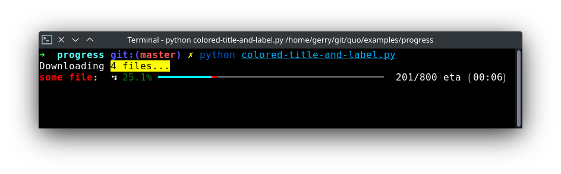
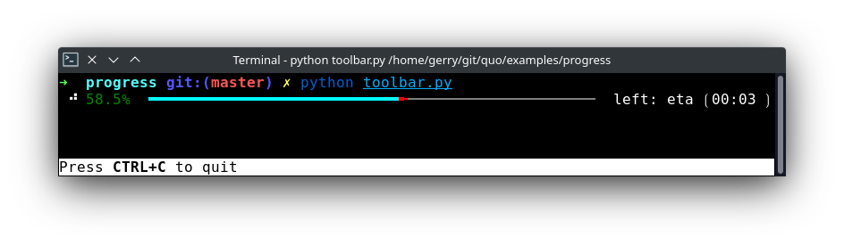
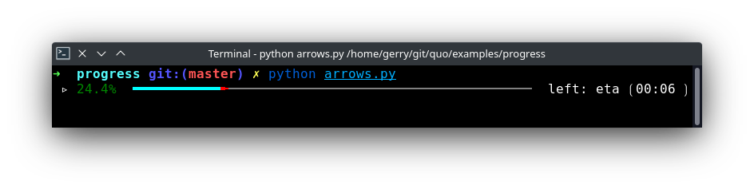
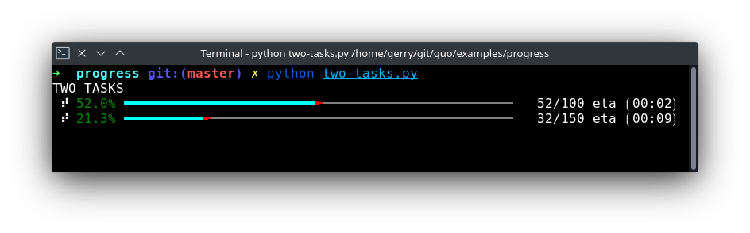
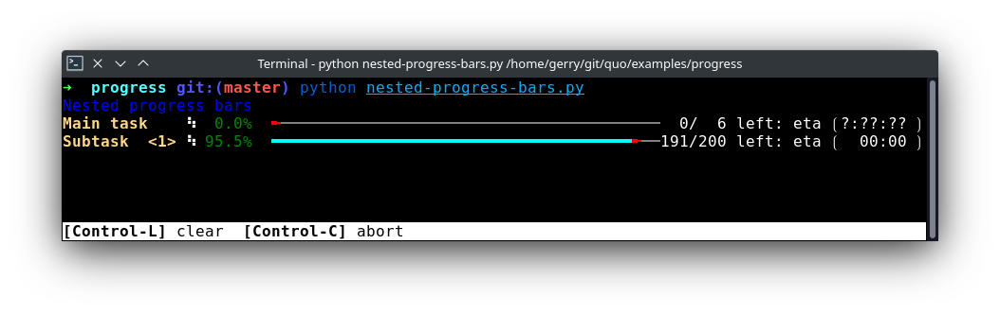
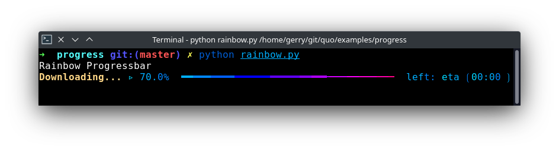
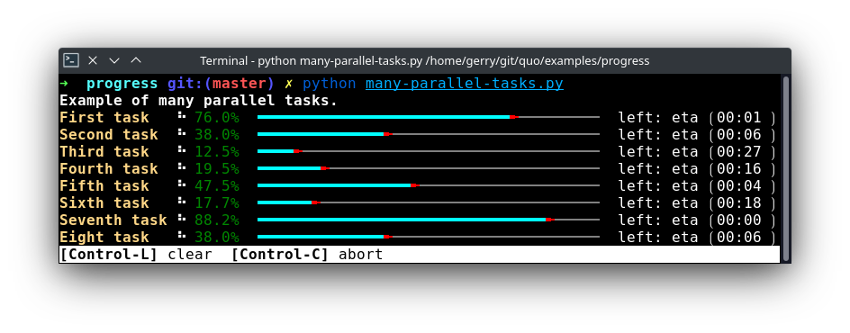

Progress bars 📊
================

A progress bar is a user interface element that indicates the progress of an operation. Progress bar supports two modes to represent progress: determinate, and indeterminate.
Showing Progress Bars
Sometimes, you have command line scripts that need to process a lot of data,
but you want to quickly show the user some progress about how long that
will take.  Quo supports simple progress bar rendering for that.

The basic usage is very simple: the idea is that you have an iterable that
you want to operate on.  For each item in the iterable it might take some
time to do processing.

``Simple progress bar``
-------------------------

Creating a new progress bar can be done by calling the
:class:`~quo.progress.ProgressBar`

The progress can be displayed for any iterable. This works by wrapping the
iterable (like ``range``) with the
:class:`~quo.progress.ProgressBar`. This
way, the progress bar knows when the next item is consumed by the forloop and
when progress happens.

.. code:: python

   import time

   from quo.progress import ProgressBar

   with ProgressBar() as pb:
       for i in pb(range(800)):
           time.sleep(.01)

Keep in mind that not all iterables can report their total length. This happens
with a typical generator. In that case, you can still pass the total as follows
in order to make displaying the progress possible:

.. code:: python

    def some_iterable():
        yield ...

    with ProgressBar() as pb:
        for i in pb(some_iterable, total=1000):
            time.sleep(.01)

``Autohide progressbar``
---------------------------

Autohide the progressbar after consuming an iterator.

*(Added on v2023.3)*

.. code:: python

   import time

   from quo.progress import ProgressBar

   with ProgressBar() as pb:
        for i in pb(range(800), auto_hide=True):
           time.sleep(.01)

``Adding a title and label``
-------------------------------

Each progress bar can have one title, and for each task an individual label.

.. code:: python

   import time

   from quo.progress import ProgressBar

   title = ""

   label = "<red>some file:</red>"

   with ProgressBar(title) as pb:
       for i in pb(range(800), label):
         time.sleep(.01)

``Adding a toolbar``
-----------------------

.. code:: python

   import time

   from quo.progress import ProgressBar

   toolbar = "Press <b>CTRL+C</b> to quit"

   with ProgressBar(toolbar=toolbar) as pb:
       for i in pb(range(800)):
         time.sleep(.01)

``Spinner themes``
--------------------------
*(Added on v2023.3)*

- ``arrows``

.. code:: python

   import time

   from quo.progress import ProgressBar

   with ProgressBar(spinner="arrows") as pb:
       for i in pb(range(800)):
           time.sleep(0.01

- ``dots3``

.. code:: python

   import time

   from quo.progress import ProgressBar

   with ProgressBar(spinner="dots3") as pb:
       for i in pb(range(800)):
           time.sleep(0.01

- ``hamburger``

.. code:: python

   import time

   from quo.progress import ProgressBar

   with ProgressBar(spinner="hamburger") as pb:
       for i in pb(range(800)):
           time.sleep(0.01

``Multiple parallel tasks``
-----------------------------

A quo :class:`~quo.progress.ProgressBar` can display the
progress of multiple tasks running in parallel. Each task can run in a separate
thread and the :class:`~quo.progress.ProgressBar` user interface
runs in its own thread.

Notice that we set the "daemon" flag for both threads that run the tasks. This
is because control-c will stop the progress and quit our application. We don't
want the application to wait for the background threads to finish. Whether you
want this depends on the application.

.. code:: python

   import threading
   import time
 
   from quo.progress import ProgressBar

   with ProgressBar("TWO TASKS") as pb:
       # Two parallel tasks.
       def task1():
           for i in pb(range(100)):
               time.sleep(.05)

       def task2():
           for i in pb(range(150)):
               time.sleep(.08)

       # Start threads.
       t1 = threading.Thread(target=task1)
       t2 = threading.Thread(target=task2)
       t1.daemon = True
       t2.daemon = True
       t1.start()
       t2.start()

       # Wait for the threads to finish. We use a timeout for the join() call,
       # because on Windows, join cannot be interrupted by Control-C or any other
       # signal.
       for t in [t1, t2]:
           while t.is_alive():
               t.join(timeout=.5)

``Nested progressbars``
---------------------------

Example of nested progress bars.

.. code:: python

   import time

   from quo.progress import ProgressBar

   title='<blue>Nested progress bars</blue>'
   toolbar="<b>[Control-L]</b> clear  <b>[Control-C]</b> abort"

   with ProgressBar(title, bottom_toolbar=toolbar)as pb:
       for i in pb(range(6), label="Main task"):
           for j in pb(range(200), label=f"Subtask  <%s>" % (i + 1,), auto_hide=True):
               time.sleep(0.01)

``Rainbow progress bar``
-------------------------------

A simple progress bar, visualised with rainbow colors for fun.

.. code:: python

   import time

   from quo.progress import ProgressBar

   with ProgressBar("Rainbow Progressbar", rainbow=True, spinner="arrows") as pb:
          for i in pb(range(20), label="Downloading...", auto_hide=True):
              time.sleep(0.1)

``Adding key bindings``
------------------------------------

Like other quo  applications, we can add custom key bindings, by passing :func:`quo.keys.bind` which is an instance of :class:`~quo.keys.Bind` object

.. code:: python

 import os
 import signal
 import time

 from quo.keys import bind
 from quo.progress import ProgressBar
 from quo.text import Text

 example = Text(' <b>[f]</b> Print "f" <b>[x]</b> Abort.')

 # Create custom key bindings first.
 cancel = [False]

 @bind.add('f')
 def _(event):
     print('You pressed `f`.')

 @bind.add('x')
 def _(event):
     " Send Abort (control-c) signal. "
     cancel[0] = True
     os.kill(os.getpid(), signal.SIGINT)

  with ProgressBar(bottom_toolbar=example) as pb
         for i in pb(range(800)):
             time.sleep(.01)

                # Stop when the cancel flag has been set.
             if cancel[0]:
                 break

 when "x" is pressed, we set a cancel flag, which stops the progress.
It would also be possible to send `SIGINT` to the mean thread, but that's not
always considered a clean way of cancelling something.

In the example above, we also display a toolbar at the bottom which shows the
key bindings.

.. image:: ./images/custom-key-bindings.png

Read more about `key bindings <https://quo.readthedocs.io/en/latest/kb.html>`_

Here's a more complex demonstration of what's possible with the progress bar.

.. code:: python

   import threading
   import time

   from quo.progress import ProgressBar

   title = "<b>Example of many parallel tasks.</b>"
   toolbar = "<b>[Control-L]</b> clear  <b>[Control-C]</b> abort"

   with ProgressBar(title, bottom_toolbar=toolbar) as pb:
       def run_task(label, total, sleep_time):
           for i in pb(range(total), label=label):
                   time.sleep(sleep_time)

       threads = [
           threading.Thread(target=run_task, args=("First task", 50, 0.1)),
           threading.Thread(target=run_task, args=("Second task", 100, 0.1)),
           threading.Thread(target=run_task, args=("Third task", 8, 3)),
           threading.Thread(target=run_task, args=("Fourth task", 200, 0.1)),
           threading.Thread(target=run_task, args=("Fifth task", 40, 0.2)),
           threading.Thread(target=run_task, args=("Sixth task", 220, 0.1)),
           threading.Thread(target=run_task, args=("Seventh task", 85, 0.05)),
           threading.Thread(target=run_task, args=("Eight task", 200, 0.05)),
       ]

       for t in threads:
           t.daemon = True
           t.start()

       # Wait for the threads to finish. We use a timeout for the join() call,
       # because on Windows, join cannot be interrupted by Control-C or any other
       # signal.
       for t in threads:
             while t.is_alive():
                t.join(timeout=0.5)

» Check out more examples `here <https://github.com/scalabli/quo
/tree/master/examples/progress/>`_
