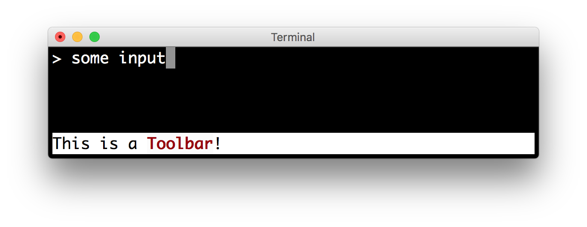
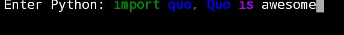
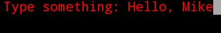

Prompts
==================

.. currentmodule:: quo

Quo supports prompts in two different places.  The first is automated
prompts when the parameter handling happens, and the second is to ask for
prompts at a later point independently.

This can be accomplished with the :func:`prompt` function, which asks for
valid input according to a type, or the :class:`quo.prompt.Prompt` object, this makes it possible to create a Prompt instance followed by calling prompt() method for every input. This creates a kind of an input session and its packed with lots of features.
You can also use the :func:`quo.confirm` function, which asks for confirmation (yes/no).

The following snippet uses the :func:`quo.prompt` function to ask the user for input
and returns the text. Just like ``input``.

.. code:: python

    from quo import prompt

    prompt('Give me some input: ')

.. image:: ./images/prompt.png

``App Prompts``
--------------

App prompts are integrated into the app interface.  See
:ref:`app-prompting` for more information.  Internally, it
automatically calls either :func:`quo.prompt` or :func:`quo.confirm` as necessary.

``Input Validation``
----------------------------
A prompt can have a validator attached. To manually ask for user input, you can use the :func:`quo.prompt` function or the :class:`quo.prompt.Prompt` object.
For instance, you can ask for a valid integer:

.. code:: python

   from quo import prompt
   
   prompt('Please enter a valid integer', type=int)

Additionally, the type will be determined automatically if a default value is
provided.  For instance, the following will only accept floats:

.. code:: python

   from quo import prompt

   prompt('Please enter a number', default=42.0)

Parameters
   * ``text`` – the text to show for the prompt.

   * ``default`` *(Optional[str, int])* – The default value to use if no input happens. If this is not given it will prompt until it’s aborted.

   * ``hide`` *(Optional[bool])* – If this is set to true then the input value will be hidden.

   * ``affirm`` – asks for confirmation for the value.

   * ``type`` – the type to use to check the value against.

   * ``value_proc`` – if this parameter is provided it’s a function that is invoked instead of the type conversion to convert a value.

   * ``suffix`` *(Optional[str])* – A suffix that should be added to the prompt.

   * ``show_default`` – shows or hides the default value in the prompt.

   * ``err`` *(Optional[bool])* – If set to true the file defaults to stderr instead of stdout, the same as with echo.

   * ``show_choices`` – Show or hide choices if the passed type is a Choice. For example if type is a Choice of either day or week, show_choices is true and text is “Group by” then the prompt will be “Group by (day, week): “.

Alternatively, you can use class:`quo.types.Validator`
This should implement the :class:`~quo.types.Validator` abstract base class. This requires only one method, named ``validate`` that
takes a :class:`~quo.document.Document` as input and raises
:class:`~quo.errors.ValidationError` when the validation fails.

Interger Validator
^^^^^^^^^^^^^^^^^^^^^
.. code:: python

    from quo.prompt import Prompt
    from quo.types import integer

    type = integer()
    
    session = Prompt(type=type)
    
    number = int(session.prompt('Give a number: '))
    print(f"You said: {number}")

.. image:: ./images/number-validator.png

By default, the input is validated in real-time while the user is typing, but
Quo can also validate after the user presses the enter key:

.. code:: python
    session = Prompt(
              type=type,
              validate_while_typing=False
              )

    session.prompt('Give a number: ')

If the input validation contains some heavy CPU intensive code, but you don't
want to block the event loop, then it's recommended to wrap the validation class in a :class:`~quo.types.ThreadedValidator`.

``Input Prompts using Prompt() class``
-------------------------------------
Input history can be kept between consecutive :func:`quo.prompt` and :class:`quo.prompt.Prompt` calls incase you want to ask for multiple inputs, but each input call needs about the same arguments.

.. code:: python

   from quo import prompt

   tex1 = prompt("What is your name?")
   text2 = prompt("Where are you from?")

.. code:: python
    
  from quo.prompt import Prompt

  # Create prompt object.
  session = Prompt()

  # Do multiple input calls.
  text1 = session.prompt("What's your name?")
  text2 = session.prompt("Where are you from?")

``Multiline Input``
-------------------
Reading multiline input is as easy as passing the ``multiline=True`` parameter.

.. code:: python

   from quo.prompt import Prompt

   session = Prompt(multiline=True)
   session.prompt('> ')                                                                                             

 
A side effect of this is that the enter key will now insert a newline instead of accepting and returning the input. The user will now have to press :kbd:`Meta+Enter` in order to accept the input. (Or :kbd:`Escape` followed by :kbd:`Enter`.)

It is possible to specify a continuation prompt. This works by passing a
``prompt_continuation`` callable to :class:`~quo.prompt.Prompt`.
This function is supposed to return :ref:`formatted text <formatted_text>`, or a list of ``(style, text)`` tuples. The width of the returned text should not
exceed the given width. (The width of the prompt margin is defined by the prompt.)

.. code:: python

    from quo.prompt import Prompt, continuation

    session = Prompt(multiline=True, prompt_continuation=continuation)

    session.prompt('multiline input> ')

.. image:: ./images/multiline-input.png

``Hide Input``
---------------

When the ``hide=True`` flag in :func:`quo.prompt` or :class:`quo.prompt.Prompt` has been given, the input is hidden in :func:`quo.prompt` or replaced by asterisks (``*`` characters) in :class:`quo.prompt.Prompt`

``Using function quo.prompt()``
^^^^^^^^^^^^^^^^^^^^^^^^^^^^^^^^^^
.. code:: python

   from quo import prompt

   prompt("Enter password: ", hide=True)

``Using class `quo.prompt.Prompt()``
^^^^^^^^^^^^^^^^^^^^^^^^^^^^^^^^^^^^^

.. code:: python

   from quo.prompt import Prompt

   session = Prompt(hide=True)

   session.prompt("Enter password: ")

``Confirmation Prompts``
-------------------------

To ask if a user wants to continue with an action, the :func:`confirm`
function comes in handy.  By default, it returns the result of the prompt
as a boolean value:
**Parameters**
    - ``text`` *(str)* – the question to ask.

    - ``default`` *(Optional[str, int])* – The default value to use when no input is given. If None, repeat until input is given.

    - ``abort`` *(Optional[bool])* – if this is set to True a negative answer aborts the exception by raising Abort.

    - ``suffix`` *(str)* – a suffix that should be added to the prompt.

    - ``show_default`` *(Optional[bool])* – shows or hides the default value in the prompt.

    - ``err`` *(bool)* – if set to true the file defaults to stderr instead of stdout, the same as with echo.

.. code:: python

   from quo import confirm
   
   confirm('Do you want to continue?')

``System prompt``
------------------
If you press :kbd:`meta-!` or :kbd:`esc-!`, you can enter system commands like `ls` or `cd`.

.. code:: python

   from quo.prompt import Prompt

   session = Prompt(system_prompt=True)

   session.prompt("Give me some input: ")

``Suspend prompt``
-------------------
Pressing :kbd:`ctrl-z` will suspend the process from running and then run the command `fg` to continue the process.

.. code:: python

   from quo.prompt import Prompt

   session = Prompt(suspend=True)

   sessiom.prompr("Give me some input: ")

``Prompt bottom toolbar``
---------------------------
Adding a bottom toolbar is as easy as passing a bottom_toolbar argument to prompt(). This argument be either plain text, formatted text or a callable that returns plain or formatted text.

When a function is given, it will be called every time the prompt is rendered, so the bottom toolbar can be used to display dynamic information.

The toolbar is always erased when the prompt returns. Here we have an example of a callable that returns a :class:`quo.text.Text` object. By default, the toolbar has the reversed style, which is why we are setting the background instead of the foreground.

.. code:: python

 from quo.prompt import Prompt
 from quo.text import Text

 def toolbar():
    return Text('This is a <b></b>!')
 # Returns a callable
 session = Prompt(bottom_toolbar=toolbar)
 session.prompt('> ')

Similar, we could use a list of style/text tuples.

.. code:: python

 from quo.prompt import Prompt

 def toolbar():
     return [('fg:white bg:green', ' This is a toolbar. ')]

 session = Prompt(bottom_toolbar=toolbar)

 session.prompt('> ')

``Right prompt(rprompt)``
--------------------------
The :class:`quo.prompt.Prompt` class has out of the box support for right prompts as well. People familiar to ZSH could recognise this as the RPROMPT option.

This can be either plain text, formatted text or a callable which returns either.

The following example returns a formatted text:

.. code:: python

 from quo.prompt import Prompt
 from quo.text import Text

 session = Prompt(rprompt=Text(''))

 session.prompt("")

The following example returns a callable

.. code:: python

 from quo.prompt import Prompt
 from quo.style import Style

   
 style = Style.add({'rprompt': 'bg:red fg:white'})
   
 def get_rprompt():
   return '<rprompt>'

 session = Prompt(
           rprompt=get_rprompt,
           style=style
           )

 session.prompt('> ')

.. image:: ./images/rprompt.png

``Syntax highlighting``
-----------------------

Quo ships with an intuitive syntax highligher.
It is also possible to create a custom highligher by implementing the :class:`~quo.highlight.Lexer` abstract base class.

.. code:: python

    from quo.prompt import Prompt
    from quo.highlight import HTML
    
    session = Prompt(highlighter=HTML)

    session.prompt('Enter HTML: ')

If you want to use another style you can do the following:»

.. code:: python

   from quo.prompt import Prompt
   from quo.highlight import Python

   session = Prompt(highlighter=Python)
   session.prompt('Enter Python code: ')

or:»

.. code:: python

   from quo.prompt import Prompt
   from quo.highlight import css

   session = Prompt(highlighter=css)
   session.prompt('Enter css: ')

Syntax highlighting is as simple as adding a highlighter. All of the available syntax styles can be found `here <http://quo.readthedocs.io/en/latest/syntax_styles.html>`_ 

``Placeholder text``
--------------------
A placeholer is a text that's displayed as long as no input is given.
This won't be returned as part of the output.
This can be a string, formatted text or a callable that returns formatted text.

Plain text placeholder
^^^^^^^^^^^^^^^^^^^^^^^^

.. code:: python

   from quo.prompt import Prompt

   session = Prompt(placeholder="..(please type something)")

   session.prompt("What is your name?: ")
 
Formatted text placeholder
^^^^^^^^^^^^^^^^^^^^^^^^^^^
.. code:: python

  from quo.prompt import Prompt
  from quo.text import Text

  session = Prompt(placeholder=Text('<gray>(please type something)</gray>'))
  session.prompt("What is your name?: ")
  

.. _colors:

``Colors``
---------

The colors for syntax highlighting are defined by a
:class:`~quo.style.Style` instance. By default, a neutral
built-in style is used, but any style instance can be passed to the :class:`~quo.prompt.Prompt` class.

.. note::
      ;func:`quo.prompt` has different semantics and cannot output colored text but :class:`quo.prompt.Prompt` is packed with several ways on how this can be achieved.

A simple way to add color to create a style, is by using the :meth:`~quo.style.Style.add` function

:ref:`Read more about styling <styling>`.

Coloring the prompt itself
^^^^^^^^^^^^^^^^^^^^^^^^^^

It is possible to add some colors to the prompt itself. For this, we need to
build some :ref:`formatted text <formatted_text>`. One way of doing this is by
creating a list of style/text tuples. In the following example, the input will be in red

.. code:: python

 from quo.prompt import Prompt
 from quo.style import Style

 style = Style.add({' ':'fg:red'}) #User input (default text) 

 session = Prompt(style=style)

 session.prompt("Type something: ")

Here's an example upgrade:

.. code:: python
 
   from quo.prompt import Prompt
   from quo.style import Style

   style = Style.add({' ':'fg:blue'}) # User input (default text)
   session = Prompt(style=style)

   message = [
       ('fg:red', 'john'),
       ('fg:white', '@'),
       ('fg:green bg:white', 'localhost'),
       ('fg:yellow', ':'),
       ('fg:cyan underline', '/user/john'),
       ('fg:red', '$ ')
   ]

   session.prompt(message)

The `message` can be any kind of formatted text, as discussed :ref:`here
<formatted_text>`. It can also be a callable that returns some formatted text.

By default, colors are taken from the 256 color palette. If you want to have 24bit true color, this is possible by adding the ``color_depth=ColorDepth.TRUE_COLOR`` option to the :class:`~quo.prompt.Prompt` .

.. code:: python

    from quo.prompt import Prompt
    from quo.color import ColorDepth

    session = Prompt(
                style=style,
                color_depth=ColorDepth.TRUE_COLOR
                )
    
             
    session.prompt(message)

``Completion``
--------------

Auto suggestion
^^^^^^^^^^^^^^^^
Auto suggestion is a way to propose some input completions to the user like the `fish shell <http://fishshell.com/>`_.

Usually, the input is compared to the history and when there is another entry starting with the given text, the completion will be shown as gray text behind the current input. Pressing the right arrow :kbd:`→` or :kbd:`ctrl-e` will insert this suggestion, :kbd:`alt-f` will insert the first word of the suggestion.

.. note::
    
   When suggestions are based on the history, don't forget to share one :class:`~quo.history.History` object between consecutive prompt calls. Using a :class:`~quo.prompt.Prompt`

Example:

.. code:: python

    from quo.prompt import Prompt
    from quo.completion import AutoSuggestFromHistory
    from quo.history import InMemoryHistory
    
    history = InMemoryHistory()
    history.append("import os")
    history.append('print("hello")') 
    history.append('print("world")')
    history.append("import path")
    
    session = Prompt(auto_suggest=AutoSuggestFromHistory(), history=history)
    
    while True:
          text = session.prompt('> ')
          print(f"You said: {text}")                                                                                    
.. image:: ./images/auto-suggestion.png

A suggestion does not have to come from the history. Any implementation of the :class:`~quo.completion.AutoSuggest` abstract base class can be passed as an argument.

Autocompletion
^^^^^^^^^^^^^^^
Autocompletion can be added by passing a completer parameter.

.. code:: python

 from quo.completion import WordCompleter
 from quo.prompt import Prompt
 
 session = Prompt()
 completer = WordCompleter(['<html>', '<body>', '<head>','<title>'])
 session.prompt('Enter HTML: ', completer=completer)

:class:`~quo.completion.WordCompleter` is a simple completer that completes the last word before the cursor with any of the given words.

.. image:: ./images/html-completion.png

Nested completion
^^^^^^^^^^^^^^^^^^

Sometimes you have a command line interface where the completion depends on the
previous words from the input. Examples are the CLIs from routers and switches.
A simple :class:`~quo.completion.WordCompleter` is not enough in that case. We want to to be able to define completions at multiple hierarchical levels. :class:`~quo.completion.NestedCompleter` solves this issue:

.. code:: python

    from quo.prompt import Prompt
    from quo.completion import NestedCompleter

    completer = NestedCompleter.add({
        'show': {
            'version': None,
            'clock': None,
            'ip': {
                'interface': {'brief'}
            }
        },
        'exit': None
     })  
     session = Prompt(completer=completer)  
     session.prompt('# ')

Whenever there is a ``None`` value in the dictionary, it means that there is no further nested completion at that point. When all values of a dictionary would be ``None``, it can also be replaced with a set.

Complete while typing
^^^^^^^^^^^^^^^^^^^^^

Autcompletions can be generated automatically while typing or when the user presses the tab key. This can be configured with the ``complete_while_typing`` option:

.. code:: python

    text = session.prompt('Enter HTML: ', completer=my_completer, complete_while_typing=True)

Notice that this setting is incompatible with the ``enable_history_search``
option. The reason for this is that the up and down key bindings would conflict
otherwise. So, make sure to disable history search for this.

``History``
------------

A :class:`~quo.history.History` object keeps track of all the previously entered strings, so that the up-arrow can reveal previously entered items.

``InMemoryHistory``
^^^^^^^^^^^^^^^^^^^^
The recommended way is to use a :class:`~quo.prompt.Prompt`, which uses an :class:`~quo.history.InMemoryHistory` which has `^` (up) arrow partial string matching enabled by default.

.. code:: python

   from quo.prompt import Prompt
   from quo.history import InMemoryHistory

   history = InMemoryHistory()
   history.append("import os")
   history.append('print("hello")')
   history.append('print("world")')
   history.append("import path")

   session = Prompt(history=history)

   while True:
       session.prompt()

``FileHistory``
^^^^^^^^^^^^^^^^
To persist a history to disk, use a :class:`~quo.history.FileHistory` instead of the default :class:`~quo.history.InMemoryHistory`. This history object can be passed to a :class:`~quo.prompt.Prompt`.
For instance:

.. code:: python

   from quo.prompt import Prompt
   from quo.history import FileHistory

   session = Prompt(history=FileHistory('~/.myhistory'))

   while True:
       session.prompt()

``Adding custom key bindings``
-------------------------------

By default, every prompt already has a set of key bindings which implements the usual Vi or Emacs behaviour. We can extend this by passing :meth:`quo.keys.bind` which is an instance of :class:`~quo.keys.Bind`.

.. note::
    :func:`quo.prompt` function does not support key bindings but :class:`quo.prompt.Prompt` does

An example of a prompt that prints ``'hello world'`` when :kbd:`Control-T` is pressed.

.. code:: python

 from quo import print
 from quo.keys import bind
 from quo.prompt import Prompt

 @bind.add('ctrl-t')
 def _(event):
 # Print `Hello, World!` when `ctrl-t` is pressed."
     print("Hello, World!")

    @bind.add('ctrl-x')
 def _(event):
   #Exit when `ctrl-x` is pressed. "
     event.app.exit()

 session = Prompt()

 session.prompt('> ')

Conditional Key bindings
^^^^^^^^^^^^^^^^^^^^^^^^^^^^^^^^^^^^^^^^^^^

Often, some key bindings can be enabled or disabled according to a certain
condition. For instance, the Emacs and Vi bindings will never be active at the
same time, but it is possible to switch between Emacs and Vi bindings at run
time.

In order to enable a key binding according to a certain condition, we have to
pass it a :class:`~quo.Condition` instance. (:ref:`Read more about filters <filters>`.)

.. code:: python

    import datetime
    from quo import Condition
    from quo.keys import bind
    from quo.prompt import Prompt

    @Condition
    def second_half():
        " Only activate key binding on the second half of each minute. "
        return datetime.datetime.now().second > 30

    @bind.add('ctrl-t', filter=second_half)
    def _(event):
        # ...
        pass
    session = Prompt()
    session.prompt('> ')

Toggle visibility of input
^^^^^^^^^^^^^^^^^^^^^^^^^^^^^^^
Display asterisks instead of the actual characters with the addition of a ControlT shortcut to hide/show the input.

.. code:: python

   from quo import Condition
   from quo.keys import bind
   from quo.prompt import Prompt
   
   hidden = [True]  # Nonlocal

   @bind.add("ctrl-t")
   def _(event):
       "When ControlT has been pressed, toggle visibility."
       hidden[0] = not hidden[0]

   session = Prompt(hide=Condition(lambda : hidden[0]))   
   session.prompt( "Password: ")

``Mouse support``
------------------
There is limited mouse support for positioning the cursor, for scrolling (in case of large multiline inputs) and for clicking in the autocompletion menu.

Enabling this can be done by passing the ``mouse_support=True`` option.

.. code:: python

    from quo.prompt import Prompt

    session = Prompt(mouse_support=True)
    session.prompt('What is your name: ')

``Line wrapping``
------------------

Line wrapping is enabled by default. This is what most people are used to and this is what GNU Readline does. When it is disabled, the input string will scroll horizontally.

.. code:: python

    from quo.prompt import Prompt

    session = Prompt(wrap_lines=False)
    session.prompt('What is your name: ')

    
» Check out more examples `here <https://github.com/scalabli/quo
/tree/master/examples/prompts/>`_
