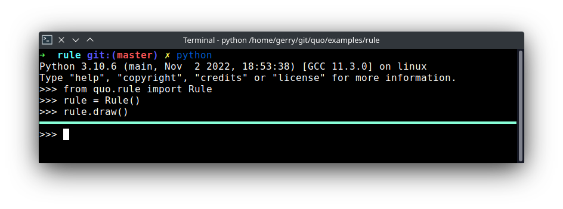

.. _rule:

Rule
========

The :class:`~quo.rule.Rule` method will draw a horizontal line.
*Added on v2023.1*

**Parameters**
      - ``multicolored`` Optional[*(bool)*] - If True, a multicolored border will be applied.  
      - ``char`` Optional[*(str)*] - Character to be used to draw out the border.
      - ``color`` Optional[*(str)*] - Color to be applied.

.. code:: python

   from quo.rule.Rule

   rule = Rule()

   rule.draw()
   

   
   
   

.. code:: python

   from quo.rule.Rule

   rule = Rule()
 
   rule.draw(multicolored=True)
   
.. image:: ./images/rule/multicolored-rule.png
