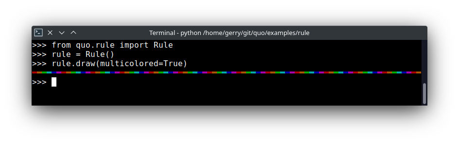
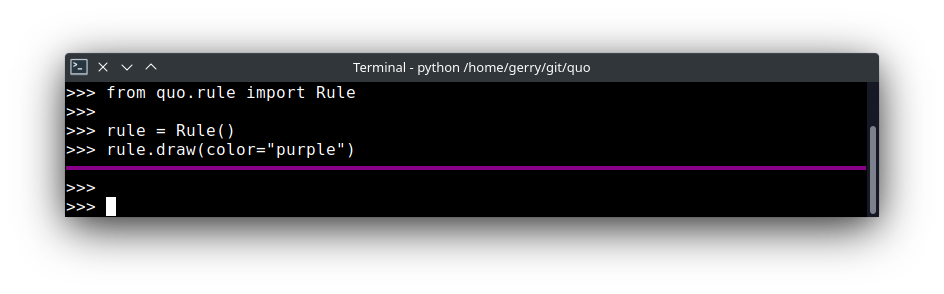
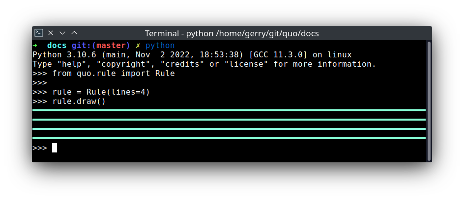

.. _rule:

Rule
========

The :class:`~quo.rule.Rule` method will draw a horizontal line.
*Added on v2023.1*

**Parameters**
      - ``char`` Optional[*(str)*] - Character to be used to draw out the border.
      - ``lines`` Optional[*(int)*] - Indicates the number of lines to be drawn.

      - ``multicolored`` Optional[*(bool)*] - If True, a multicolored border will be applied.  
      - ``color`` Optional[*(str)*] - Color to be applied.

.. code:: python

   from quo.rule import Rule

   rule = Rule()

   rule.draw()
   
.. image:: ./images/rule/default.png
   
     
- Multicolored

.. code:: python

   from quo.rule import Rule

   rule = Rule()
 
   rule.draw(multicolored=True)
   

- Styled
.. code:: python

   from quo.rule import Rule

   rule = Rule()
   rule.draw(color="purple")

- Multiline

*Added on v2023.3*

.. code:: python

   from quo.rule import Rule

   rule = Rule(lines=4)

   rule.draw()
   

   