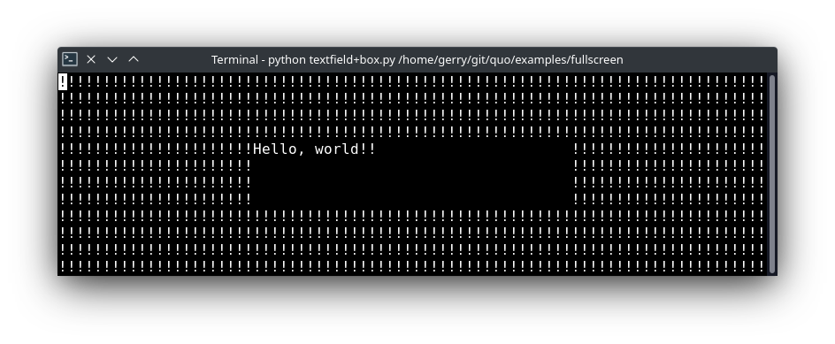
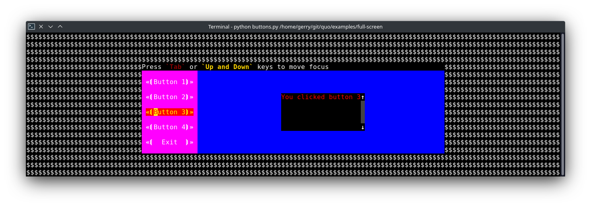

.. _full_screen_applications:

Text User Interface (Full screen Command-line applications)
=================================================================

`quo` can be used to create complex full screen terminal
applications. Typically, an application consists of a layout (to describe the
graphical part) and a set of key bindings.

The sections below describe the components required for full screen
applications (or custom, non full screen applications), and how to assemble
them together.

.. note::

    Also remember that the ``examples`` directory of the quo
    repository contains plenty of examples. Each example is supposed to explain
    one idea. So, this as well should help you get started.

    Don't hesitate to open a GitHub issue if you feel that a certain example is
    missing.

``A simple application``
------------------------

Almost every quo application is an instance of an :func:`~quo.container`. The simplest full screen example would look like this:

.. code:: python

   from quo import container
   from quo.label import Label

   content = Label("Hello, world")

   container(content)

This will only consume the least amount of space required.

.. note::

        If we set the ``full_screen`` option, the application will run in an alternate screen buffer, in full screen mode.
       Starting with v2022.4.5, :kbd:`ctrl-c` will be the default key binder for to exit the app, you will still be able to define your own set of key bindings.

.. code:: python

   from quo import container
   from quo.textfield import TextField

   content = TextField("Hello, world")
   container(content, bind=True, full_screen=True)
 
An application consists of several components. The most important are:

- I/O objects: the input and output device.
- The layout: this defines the graphical structure of the application. For
  instance, a text box on the left side, and a button on the right side.
- A style: this defines what colors and underline/bold/italic styles are used
  everywhere.
- A set of key bindings.

We will discuss all of these in more detail below.

``The layout``
----------------
Under the hood, class :class:`~quo.layout.Layout` is the layout for function :func:`~quo.container`.

- Here's a simple example of a a text area displaying `Hello World!`

.. code:: python

   from quo import container
   from quo.box imort Box
   from quo.textfield TextField
 
   # Layout for displaying hello world.
   # (The box takes care of the margin/padding.)

   textfield = TextField("Hello, world!!")
 
   content = Box(textfield)

   container(content, bind=True, full_screen=True)

In the example above, the Layout consists of :class:`Box`  and :class:`TextField` for displaying hello world.

The class :class:`Box` takes care of the margin/padding and class :class:`TextField` takes care of the text to be printed.
:func:`quo.container` prints the layout.

container
^^^^^^^^^^
Print the layout to the output

**Parameters**
     - ``container`` - AnyContainer
     - ``bind`` *(bool)* - When True, initiate a :class:`~quo.keys.Bind` instance for the key bindings.
     - ``full_screen`` *(bool)* - When True, run the application on the alternate screen buffer.
     - ``focused_element`` - element to be focused initially. *(Can be anything the `focus` function accepts.)*
     - ``mouse_support`` - :class:`~quo.filters.Filter` or boolean. When True, enable mouse support. 
     - ``style`` - A style string.

Here's a simple example of a few buttons and click handlers.

» Source code `here <https://github.com/scalabli/quo/tree/master/examples/fullscreen/click-handlers.py>`_

A layered layout architecture
^^^^^^^^^^^^^^^^^^^^^^^^^^^^^

There are several ways to create a layout, depending on how
customizable you want things to be.

  Examples of :class:`~quo.layout.Container` objects are
  :class:`~quo.layout.VSplit` (vertical split),
  :class:`~quo.layout.HSplit` (horizontal split)

  :class:`~quo.window.Window` object is a special kind of
  container that can contain objects responsible
  for the generation of content. The
  :class:`~quo.layout.Window` object acts as an adaptor between the
  :class:`~quo.layout.UIControl` and other containers, but it's also
  responsible for the scrolling and line wrapping of the content.

  
Quo contains several widgets like:
  :class:`~quo.button.Button`,
  :class:`~quo.frame.Frame`,
  :class:`~quo.label.Label`,
  :class:`~quo.textfield.TextField`,

- The highest level abstractions can be found in the ``dialog`` module.

More complex layouts can be achieved by nesting multiple
:class:`~quo.layout.VSplit`,
:class:`~quo.layout.HSplit`

HSplit
--------
Several layouts, one stacked above/under the other. like so::

        +--------------------+
        |                    |
        +--------------------+
        |                    |
        +--------------------+
        
By default, this doesn't display a horizontal line between the children, but if this is something you need, then create a HSplit as follows:

.. code:: python

   HSplit(subset=[ ... ], padding_char='-', padding=1, padding_style='fg:red')

**Parameters**

  - ``subset`` - List of child :class:`.Container` objects.
  - ``window_too_small`` - A :class:`.Container` object that is displayed if there is not enough space for all the subsets. By default, this is a "Window too small" message.
  - ``align`` - A `VerticalAlign` value. i.e ``top``, ``center``, ``bottom`` or ``justify``
  - ``width`` - When given, use this width instead of looking at the subsets.
  - ``height`` -  When given, use this height instead of looking at the subsets.
  - ``z_index``-  (int or None) When specified, this can be used to bring element in front of floating elements.  `None` means: inherit from parent.
  - ``style`` - A style string.
  - ``modal`` *(bool)* - Setting ``modal=True`` makes what is called a **modal** container. Normally, a subset container would inherit its parent key bindings. This does not apply to **modal** containers.
  
  - ``bind`` - ``None`` or a :class:`.Bind` object.
  - ``padding`` - (`Dimension` or int), size to be used for the padding.                  - ``padding_char`` - Character to be used for filling in the padding.
  - ``padding_style`` - Style to applied to the padding.
    
.. code:: python

   from quo import container
   from quo.layout import HSplit
   from quo.window import Window
   from quo.label import Label
 
   # 1. The layout
   content = HSplit([
          Label("\n\n(Top pane)"),
          Window(height=1, char="-"),  # Horizontal line in the middle.
          Label("\n\n(Bottom pane)")
          ])
        
   # 2. The `Application`
   # Press `ctrl-c` to exit 
   container(content, bind=True)

VSplit
--------

Several layouts, one stacked left/right of the other like so::

        +---------+----------+
        |         |          |
        |         |          |
        +---------+----------+

By default, this doesn't display a vertical line between the children, but if this is something you need, then create a VSplit as follows:

.. code:: python

   VSplipt([ ... ], padding_char='|', padding=1, padding_style='fg:blue')

**Parameters**
    - ``subset`` - List of subsets :class:`.Container` objects.
    - ``window_too_small`` - A :class:`.Container` object that is displayed if there is not enough space for all the children. By default, this is a "Window too small" message.
    - ``align``- A `HorizontalAlign` value. i.e ``left``, ``centre``, ``right`` or ``justify``
    - ``width`` - When given, use this width instead of looking at the subsets.
    - ``height`` - When given, use this height instead of looking at the subsets.
    - ``z_index`` - (int or None) When specified, this can be used to bring element in front of floating elements.  `None` means: inherit from parent.
    - ``style`` - A style string.
    - ``modal`` *(bool)* - Setting ``modal=True`` makes what is called a **modal** container. Normally, a subset container would inherit its parent key bindings. This does not apply to **modal** containers.
    - ``bind`` - ``None`` or a :class:`.Bind` object.
    - ``padding`` - (`Dimension` or int), size to be used for the padding.
    - ``padding_char`` - Character to be used for filling in the padding.
    - ``padding_style`` - Style to applied to the padding.

.. code:: python

   # Press `ctrl-c` to exit
   from quo import container
   from quo.label import Label
   from quo.layout import VSplit
   from quo,window import Window

 
   # 1. The layout
   content = VSplit([
            Label("(Left pane)"),
            Window(width=1, char="|"), # Vertical line in the middle.
            Label("(Right pane)")
            ])
          
   container(content, bind=True, full_screen=True)
 

``Key bindings``
-----------------

Global key bindings
^^^^^^^^^^^^^^^^^^^

Key bindings can be passed to the application as follows:

.. code:: python

   from quo import container
   from quo.keys import bind

   container(bind=True)

Registering Key bindings
^^^^^^^^^^^^^^^^^^^^^^^^^^
To register a new keyboard shortcut, we can use the
:meth:`~quo.keys.Bind.add` method as a decorator of the key handler:

.. code:: python   

   from quo import container
   from quo.keys import bind
   from quo.textfield import TextField
 
   content = TextField("Hello, world")
 
   # A custom Key binder to exit the application
   @bind.add("ctrl-q")
   def exit_(event):
         """
         Pressing "ctrl-q" will exit the user interface
         """
        event.app.exit()
        
   container(content, bind=True, full_screen=True)

The callback function is named ``exit_`` for clarity, but it could have been named ``_`` (underscore) as well, or anything you see fit

Read more about `key bindings <https://quo.readthedocs.io/en/latest/kb.html>`_

 
:class:`~quo.layout.VSplit` and :class:`~quo.layout.HSplit` take a ``modal`` argument.

Setting ``modal=True`` makes what is called a **modal** container. Normally, a child container would inherit its parent key bindings. This does not apply to **modal** containers.

Consider a **modal** container (e.g. :class:`~quo.layout.VSplit`)
is child of another container, its parent. Any key bindings from the parent are not taken into account if the **modal** container (subset) has the focus.

This is useful in a complex layout, where many controls have their own key bindings, but you only want to enable the key bindings for a certain region of the layout.

The global key bindings are always active.

Window
^^^^^^^^
:class:`~quo.layout.Window` is a :class:`~quo.layout.Container` that wraps a :class:`~quo.layout.UIControl`, like a :class:`~quo.layout.BufferControl` or :class:`~quo.layout.FormattedTextControl`.

**Parameters**
    - ``content`` - :class:`.UIControl` instance.
    - ``width`` - :class:`.Dimension` instance or callable.
    - ``height`` - :class:`.Dimension` instance or callable.
    - ``z_index`` - When specified, this can be used to bring element in front of floating elements.
    - ``fixed_width`` *(bool)* - When `True`, don't take up more width then the preferred width reported by the control.
    - ``fixed_height`` *(bool)* - When `True`, don't take up more width then the  preferred height reported by the control.
    - ``ignore_content_width`` *(bool)* - A `bool` or :class:`.Filter` instance. Ignore the :class:`.UIContent` width when calculating the dimensions.
    - ``ignore_content_height`` *(bool)* - A `bool` or :class:`.Filter` instance. Ignore the :class:`.UIContent` height when calculating the dimensions.
    - ``left_margins`` - A list of :class:`.Margin` instance to be displayed on the left. For instance: :class:`~quo.layout.NumberedMargin` can be one of them in order to show line numbers.
    - ``right_margins`` - Like `left_margins`, but on the other side.
    - ``scroll_offsets`` - :class:`.ScrollOffsets` instance, representing the preferred amount of lines/columns to be always visible before/after the cursor. When both top and bottom are a very high number, the cursor will be centered vertically most of the time.
    - ``allow_scroll_beyond_bottom`` *(bool)* - A `bool` or :class:`.Filter` instance. When True, allow scrolling so far, that the top part of the content is not visible anymore, while there is still empty space available at the bottom of the window. In the Vi editor for instance, this is possible. You will see tildes while the top part of the body is hidden.
    - ``wrap_lines`` *(bool)** - A `bool` or :class:`.Filter` instance. When True, don't scroll horizontally, but wrap lines instead.
    - ``get_vertical_scroll`` - Callable that takes this window instance as input and returns a preferred vertical scroll. *(When this is `None`, the scroll is only determined by the last and current cursor position.)*
    - ``get_horizontal_scroll`` - Callable that takes this window instance as input and returns a preferred vertical scroll.
    - ``always_hide_cursor`` *(bool)* - A `bool` or :class:`.Filter` instance. When True, never display the cursor, even when the user control specifies a cursor position.
    - ``cursorline`` *(bool)* - A `bool` or :class:`.Filter` instance. When True, display a cursorline.
    - ``cursorcolumn`` *(bool)* - A `bool` or :class:`.Filter` instance When True, display a cursorcolumn.
    - ``colorcolumns`` - A list of :class:`.ColorColumn` instances that describe the columns to be highlighted, or a callable that returns such a list.
    - ``align`` - :class:`.WindowAlign` value or callable that returns an :class:`.WindowAlign` value. alignment of content. i.e ``left``, ``centre`` or ``right``
    - ``style`` - A style string. Style to be applied to all the cells in this  window. *(This can be a callable that returns a string.)*
    - ``char`` *(str)* - Character to be used for filling the background. This can also be a callable that returns a character.
    - ``get_line_prefix`` - None or a callable that returns formatted text to  atted text to be inserted before a line. It takes a line number (int) and a wrap_count and returns formatted text. This can be used for implementation of line continuations, things like Vim "breakindent".
      

» Check out more examples `here <https://github.com/scalabli/quo
/tree/master/examples/fullscreen/>`_

